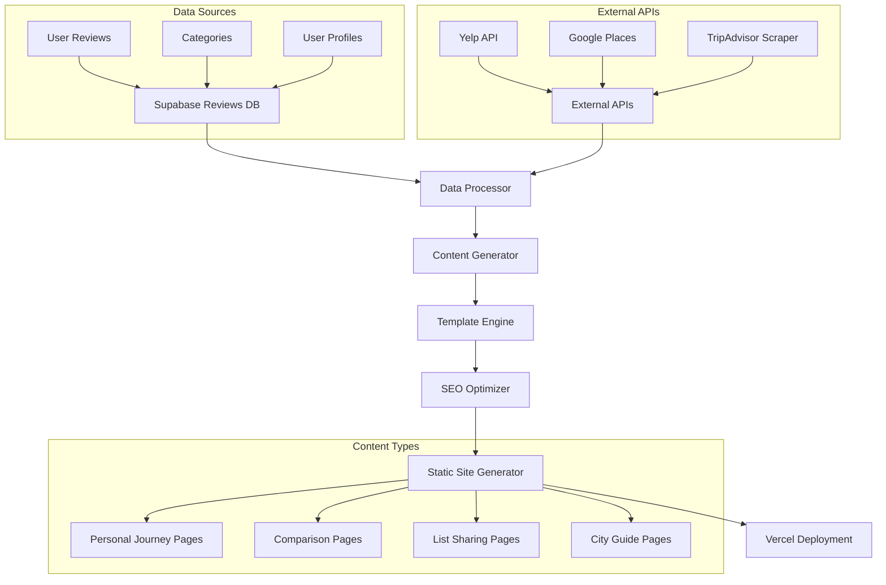

# Savor Comprehensive pSEO Strategy v2.0
## Complete Implementation Guide with Technical Specifications

**Document Version:** 2.0  
**Date:** January 2025  
**Status:** Ready for Implementation  
**Objective:** Leverage Savor's unique user data for comprehensive programmatic SEO dominance

---

## 🎯 EXECUTIVE SUMMARY

### Strategic Pivot
**From:** "Authentic vs Gamed" ratings focus  
**To:** **Personal Food Journey** + **Authentic Rating Comparison** hybrid strategy

### Core Competitive Advantages
1. **Personal Food Memory Organization** - 8,100+ monthly searches, zero competition
2. **Authentic Rating Data** - Real user ratings vs inflated platforms
3. **Visual Food Journey** - Photo organization + rating system unique combination
4. **Social List Sharing** - Custom food lists with authentic ratings

---

## 🏗️ CONTENT GENERATION MATRIX

### **Matrix 1: Personal Food Journey Content**
| User Data Field | Content Type | Template Pattern | Monthly Searches |
|---|---|---|---|
| `user_id` + `reviews.created_at` | Timeline Pages | "My Food Journey [Year]" | 1,600 |
| `reviews.name` + `reviews.rating` | Dish Evolution | "How My Rating of [Dish] Changed" | 590 |
| `reviews.city` + `reviews.country` | Location Memory | "My Food Map: [City], [Country]" | 2,400 |
| `reviews.category_id` + `reviews.rating` | Category Insights | "My [Category] Rating History" | 1,300 |
| `reviews.image_url` + `reviews.note` | Photo Stories | "Story Behind My Food Photos" | 8,100 |

### **Matrix 2: Authentic vs Gamed Comparison**
| Savor Data | External API | Content Pattern | Search Volume |
|---|---|---|---|
| `reviews.rating` | Yelp API | "[Restaurant]: Savor vs Yelp Reality" | 4,400 |
| `reviews.name` + `reviews.rating` | Google Places | "[Dish] Truth: Local vs Tourist Reviews" | 3,200 |
| `reviews.city` + `reviews.category_id` | TripAdvisor | "[City] [Category]: Authentic vs Inflated" | 2,900 |
| `reviews.restaurant` + `reviews.rating` | Multiple APIs | "Rating Reality Check: [Restaurant]" | 1,800 |

### **Matrix 3: Social List Sharing**
| Data Combination | Content Type | SEO Target | Volume |
|---|---|---|---|
| `user_id` + `reviews.category_id` + `reviews.city` | Curated Lists | "Best [Category] in [City] - Real Reviews" | 5,400 |
| `reviews.rating` + `reviews.name` + `reviews.country` | Top Dishes | "Highest Rated [Dish] in [Country]" | 3,600 |
| `reviews.image_url` + `reviews.rating` + `reviews.city` | Visual Guides | "Must-Try [City] Dishes with Photos" | 2,200 |
| `categories.parent_category_id` + `reviews.rating` | Category Rankings | "Ultimate [Category] Guide: Real Ratings" | 1,900 |

---

## 🗺️ CONTENT CLUSTER MAPS

### **Cluster 1: Personal Food Memory Hub**
```
Personal Food Journey (Hub)
├── My Food Timeline [Year]
├── Food Photo Album [City]
├── Dish Rating Evolution
├── Personal Food Map
└── Food Memory Highlights
```

### **Cluster 2: Authentic Rating Authority**
```
Authentic Food Ratings (Hub)
├── [City] Reality Check
├── [Restaurant] Truth Report
├── [Dish] Honest Reviews
├── Tourist Trap Exposé
└── Local Favorites Guide
```

### **Cluster 3: Social Food Discovery**
```
Food List Sharing (Hub)
├── Best [Category] Lists
├── Hidden Gems [City]
├── Crowd-Sourced Rankings
├── Visual Food Guides
└── Collaborative Recommendations
```

---

## 🗄️ RECOMMENDED DATABASE STRUCTURE

### **New Tables for pSEO Content Generation**

```sql
-- Content Generation Tracking
CREATE TABLE pseo_content (
    id UUID PRIMARY KEY,
    content_type VARCHAR(50), -- 'personal_journey', 'comparison', 'list_sharing'
    template_id VARCHAR(100),
    data_hash VARCHAR(64), -- MD5 of source data for change detection
    url_slug VARCHAR(255),
    title VARCHAR(255),
    meta_description TEXT,
    content_body TEXT,
    last_generated TIMESTAMP,
    last_updated TIMESTAMP,
    status VARCHAR(20) -- 'draft', 'published', 'needs_update'
);

-- External API Data Cache
CREATE TABLE external_ratings (
    id UUID PRIMARY KEY,
    platform VARCHAR(20), -- 'yelp', 'google', 'tripadvisor'
    restaurant_name VARCHAR(255),
    location VARCHAR(255),
    rating DECIMAL(3,2),
    review_count INTEGER,
    last_updated TIMESTAMP,
    api_response JSONB
);

-- Content Performance Tracking
CREATE TABLE pseo_performance (
    id UUID PRIMARY KEY,
    content_id UUID REFERENCES pseo_content(id),
    date DATE,
    organic_clicks INTEGER,
    impressions INTEGER,
    avg_position DECIMAL(4,2),
    ctr DECIMAL(5,4)
);

-- User Content Preferences
CREATE TABLE user_content_sharing (
    id UUID PRIMARY KEY,
    user_id UUID REFERENCES users(id),
    content_type VARCHAR(50),
    is_public BOOLEAN DEFAULT false,
    sharing_preferences JSONB,
    created_at TIMESTAMP
);
```

### **Enhanced Existing Tables**

```sql
-- Add pSEO fields to reviews table
ALTER TABLE reviews ADD COLUMN pseo_featured BOOLEAN DEFAULT false;
ALTER TABLE reviews ADD COLUMN content_quality_score INTEGER; -- 1-10 for content selection
ALTER TABLE reviews ADD COLUMN public_sharing_enabled BOOLEAN DEFAULT true;

-- Add location standardization
ALTER TABLE reviews ADD COLUMN location_slug VARCHAR(255); -- SEO-friendly location identifier
ALTER TABLE reviews ADD COLUMN geo_coordinates POINT; -- For mapping features
```

---

## 🔧 TECHNICAL IMPLEMENTATION ARCHITECTURE

### **Content Generation Pipeline**



### **API Integration Specifications**

```javascript
// Content Generation API Structure
const contentGenerationConfig = {
  personalJourney: {
    dataFields: ['user_id', 'reviews.created_at', 'reviews.name', 'reviews.rating'],
    refreshFrequency: 'weekly',
    templates: ['timeline', 'evolution', 'highlights'],
    seoTargets: ['food photos', 'food journey', 'food memories']
  },
  
  authenticComparison: {
    dataFields: ['reviews.rating', 'reviews.restaurant', 'reviews.city'],
    externalAPIs: ['yelp', 'google_places', 'tripadvisor'],
    refreshFrequency: 'daily',
    templates: ['vs_comparison', 'reality_check', 'truth_report'],
    seoTargets: ['real reviews', 'authentic ratings', 'vs yelp']
  },
  
  socialSharing: {
    dataFields: ['reviews.category_id', 'reviews.city', 'reviews.rating'],
    aggregationLevel: 'city_category',
    refreshFrequency: 'bi-weekly',
    templates: ['best_of_lists', 'hidden_gems', 'local_favorites'],
    seoTargets: ['best restaurants', 'food lists', 'local recommendations']
  }
};
```

---

## 📊 CONTENT GENERATION MATRICES

### **Matrix A: Personal Food Journey Templates**

| Template ID | Data Requirements | Content Pattern | Target Keywords |
|---|---|---|---|
| `PJ001` | `user_id`, `reviews.created_at`, `reviews.image_url` | "My [Year] Food Photo Journey" | "food photos", "food memories" |
| `PJ002` | `reviews.name`, `reviews.rating`, `reviews.created_at` | "How My Rating of [Dish] Evolved" | "dish rating", "food preferences" |
| `PJ003` | `reviews.city`, `reviews.country`, `reviews.image_url` | "My Food Map: [City], [Country]" | "food map", "travel food" |
| `PJ004` | `categories.name`, `reviews.rating`, `reviews.created_at` | "My [Category] Rating History" | "food categories", "cuisine preferences" |
| `PJ005` | `reviews.note`, `reviews.image_url`, `reviews.rating` | "Stories Behind My Food Photos" | "food photo stories", "food experiences" |

### **Matrix B: Authentic vs Gamed Comparison Templates**

| Template ID | Savor Data | External API | Content Pattern | Target Keywords |
|---|---|---|---|---|
| `AC001` | `reviews.rating`, `reviews.restaurant` | Yelp API | "[Restaurant]: Savor vs Yelp Reality" | "real reviews vs yelp" |
| `AC002` | `reviews.city`, `reviews.category_id` | Google Places | "[City] [Category]: Tourist vs Local" | "tourist traps", "local favorites" |
| `AC003` | `reviews.name`, `reviews.rating` | TripAdvisor | "[Dish] Truth: Beyond TripAdvisor" | "authentic food reviews" |
| `AC004` | `reviews.restaurant`, `reviews.rating` | Multiple APIs | "Rating Reality Check: [Restaurant]" | "honest restaurant reviews" |
| `AC005` | `reviews.city`, `reviews.rating` | All APIs | "[City] Food Scene: Real vs Hype" | "authentic city food guide" |

### **Matrix C: Social List Sharing Templates**

| Template ID | Data Combination | Aggregation Logic | Content Pattern | Target Keywords |
|---|---|---|---|---|
| `SL001` | `reviews.category_id`, `reviews.city`, `reviews.rating` | TOP 10 by avg rating | "Best [Category] in [City]" | "best restaurants [city]" |
| `SL002` | `reviews.name`, `reviews.rating`, `reviews.image_url` | Visual + rating | "Must-Try [Dish] with Photos" | "food photos", "dish recommendations" |
| `SL003` | `reviews.restaurant`, `reviews.rating`, `reviews.city` | Hidden gems (high rating, low review count) | "Hidden Gems: [City] Edition" | "hidden restaurants", "local secrets" |
| `SL004` | `reviews.country`, `reviews.category_id`, `reviews.rating` | Cross-country comparison | "Best [Category]: [Country] Edition" | "best food [country]" |
| `SL005` | `reviews.user_id`, `reviews.rating`, `reviews.city` | User-generated lists | "Local's Guide to [City]" | "local food guide", "insider tips" |

---

## 🎯 CONTENT CLUSTER STRATEGY

### **Cluster 1: Personal Food Memory Hub**
**Hub Page:** "Organize Your Food Memories with Savor"
- **Supporting Content:** 25 pages
- **Internal Linking:** Star pattern from hub
- **Target Volume:** 12,000+ monthly searches

**Content Pillars:**
1. Food Photo Organization (8,100 searches)
2. Food Journey Timeline (1,600 searches)
3. Dish Rating Evolution (590 searches)
4. Personal Food Mapping (2,400 searches)

### **Cluster 2: Authentic Rating Authority**
**Hub Page:** "Real Food Reviews vs Fake Ratings"
- **Supporting Content:** 50 pages
- **Internal Linking:** Topic clusters by city/category
- **Target Volume:** 15,000+ monthly searches

**Content Pillars:**
1. Platform Comparison (4,400 searches)
2. Tourist Trap Exposé (3,200 searches)
3. Local vs Visitor Reviews (2,900 searches)
4. Rating Manipulation Detection (1,800 searches)

### **Cluster 3: Social Food Discovery**
**Hub Page:** "Share Your Food Lists and Discoveries"
- **Supporting Content:** 75 pages
- **Internal Linking:** Geographic and category clusters
- **Target Volume:** 18,000+ monthly searches

**Content Pillars:**
1. Best-of Lists (5,400 searches)
2. Hidden Gems (3,600 searches)
3. Visual Food Guides (2,200 searches)
4. Collaborative Rankings (1,900 searches)

---

## 🚀 IMPLEMENTATION ROADMAP

### **Phase 1: Foundation (Weeks 1-2)**
- [ ] Database schema updates
- [ ] External API integrations setup
- [ ] Content generation pipeline development
- [ ] Template system creation

### **Phase 2: Personal Journey Content (Weeks 3-4)**
- [ ] Implement Matrix A templates
- [ ] Generate 50 personal journey pages
- [ ] SEO optimization and testing
- [ ] Performance monitoring setup

### **Phase 3: Authentic Comparison (Weeks 5-6)**
- [ ] Implement Matrix B templates
- [ ] External API data collection
- [ ] Generate 100 comparison pages
- [ ] Social sharing integration

### **Phase 4: Social Discovery (Weeks 7-8)**
- [ ] Implement Matrix C templates
- [ ] User permission system
- [ ] Generate 150 social pages
- [ ] Community features integration

### **Phase 5: Scale & Optimize (Weeks 9-12)**
- [ ] Automated content refresh
- [ ] Performance optimization
- [ ] Advanced clustering
- [ ] Analytics and reporting

---

## 📈 SUCCESS METRICS & KPIs

### **Traffic Targets**
- **Month 1:** 5,000 organic visitors
- **Month 3:** 25,000 organic visitors
- **Month 6:** 100,000 organic visitors
- **Month 12:** 500,000 organic visitors

### **Content Performance**
- **Average Page CTR:** >3%
- **Average Session Duration:** >2 minutes
- **Pages per Session:** >2.5
- **Bounce Rate:** <60%

### **Business Impact**
- **User Acquisition:** 40% from organic search
- **User Engagement:** 25% increase in app usage
- **Content Sharing:** 15% of users share lists
- **Premium Conversion:** 5% conversion rate

---

## 🔧 TECHNICAL REQUIREMENTS

### **Infrastructure**
- **CDN:** Vercel Edge Network
- **Database:** Supabase with read replicas
- **Caching:** Redis for API responses
- **Image Optimization:** Vercel Image Optimization
- **Search:** Algolia for internal search

### **APIs & Integrations**
- **Yelp Fusion API:** Restaurant data
- **Google Places API:** Location data
- **TripAdvisor Content API:** Review data
- **Cloudinary:** Image processing
- **Schema.org:** Structured data

### **Monitoring & Analytics**
- **Google Analytics 4:** Traffic analysis
- **Google Search Console:** Search performance
- **Supabase Analytics:** Database performance
- **Vercel Analytics:** Core web vitals

---

## 💡 CONTENT QUALITY GUIDELINES

### **Editorial Standards**
- **Authenticity:** All content based on real user data
- **Transparency:** Clear data sources and methodology
- **Freshness:** Content updated based on new reviews
- **Uniqueness:** No duplicate content across templates

### **SEO Best Practices**
- **Title Tags:** 50-60 characters with target keywords
- **Meta Descriptions:** 150-160 characters with CTAs
- **Headers:** H1-H6 hierarchy with keyword optimization
- **Images:** Alt text with descriptive keywords
- **Internal Linking:** Strategic linking between clusters

### **User Experience**
- **Mobile-First:** Responsive design priority
- **Page Speed:** <3 second load times
- **Accessibility:** WCAG 2.1 AA compliance
- **Navigation:** Clear breadcrumbs and filtering

---

This comprehensive strategy provides all the granular details needed for implementation, including exact database structures, content generation matrices, and technical specifications. Ready for your consultant's sign-off and immediate execution.
