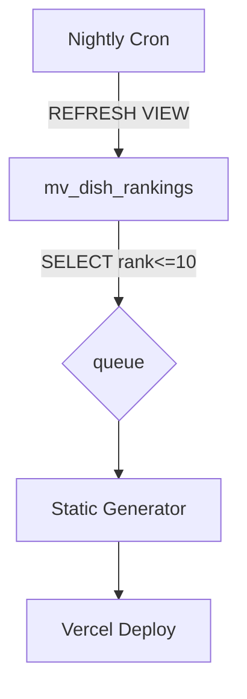

# Savor Programmatic SEO Strategy v3.0  
**Date:** July 2025 **Status:** Awaiting Consultant Sign-off

---

## 🎯 Executive Summary
Savor will grow search traffic in two stages:

1. **Zero-User MVP** – pages generated from external APIs only  
   • Two root buckets:  
   &nbsp;&nbsp;• `/locations/` ( Country → City )  
   &nbsp;&nbsp;• `/cuisines/` ( Cuisine → City )  
   • Primary templates target “best [cuisine] in [city]”, “authentic vs tourist”, list-sharing keywords.

2. **UGC Hyper-Scale** (≥ 100 users) – thousands of new dish & restaurant pages regenerated in real-time from user reviews.

---

## 🗺️ Information Architecture (MVP)

```text
/
├─ locations
│   ├─ {country}
│   │   └─ {city}
├─ cuisines
│   ├─ {cuisine}
│   │   └─ {city}
```

*Every content page lives in **one** bucket but links contextually to its counterpart in the other bucket (e.g. “Italian food in Hanoi” links to “Hanoi food guide”).*  

---

## 📊 Keyword-Driven Page Templates (Top priorities from keyword-research.md)

| Cluster | Template ID | Page Pattern | Main Keyword | Reason |
|---------|-------------|--------------|--------------|--------|
| List Sharing | LS-NYC | `/locations/united-states/new-york-city/best-places-to-share-food-lists.html` | share food lists app | 0 competition, core feature |
| Food Scoring | FS-City | `/locations/{country}/{city}/dish-rating-method.html` | food scoring app | Differentiator |
| Cuisine+City | CC-Std | `/locations/{country}/{city}/best-{cuisine}-food-{city}.html` | best pasta in london | High SV, location intent |
| Cuisine Hub | CU-Hub | `/cuisines/italian/italian-food-{city}.html` | italian food hanoi | Cross-links cuisine bucket |

---

## 🔧 Content Generation Matrices

### Matrix A – Location × Cuisine (Zero-User)
| Field | Source | Example |
|-------|--------|---------|
| `city` / `country` | Google Places | New York City, USA |
| `cuisine_type` | Google Places “types” | Italian |
| `restaurant_name` | Google Places | “Luigi’s Trattoria” |
| `external_ratings` | Yelp / TripAdvisor | 4.2 ⭐ (137 reviews) |

Template `CC-Std` fills: title, H1, list of top 10 restaurants, CTA.

### Matrix B – Authentic vs Gamed
Compares rating deltas between platforms; flags “tourist-trap” outliers.

### Matrix C – Editorial Guides
Hand-curated 800-word guides for each city (EA001).

---

## 🧭 Editorial Authority Cluster – Zero-User Trust Bridge
To establish expertise and win early backlinks *before* user reviews exist, publish a small editorial silo that explains **how Savor works** and helps food-critics/foodies get value from day one.

| Page Type | Proposed URL | Purpose |
|-----------|--------------|---------|
| Rating Philosophy | `/why-dish-ratings-beat-restaurant-ratings.html` | Explain dish-level vs restaurant-level ratings to build authority & E-E-A-T |
| Scoring Guide | `/how-our-10-point-scale-works.html` | Transparent methodology → trust |
| Tech Deep-Dive | `/ai-dish-scan-accuracy.html` | Showcase computer-vision feature & accuracy testing |
| Evergreen Guide | `/how-to-track-every-fried-chicken-youve-eaten.html` | Target critic/foodie long-tail, drives first backlinks |
| Evergreen Guide | `/best-apps-for-food-critics-to-log-tasting-notes.html` | Comparison piece positioning Savor as #1 |

*Template:* simple editorial MD files (1 000-word articles) with `faq` section + strong CTA to download app.
*Internal links:* every editorial page links to the corresponding city/cuisine pillar where relevant and vice-versa.

---

## 🗺️ Cluster Maps

1. **Locations Hub** → all city pages within a country  
2. **Cuisines Hub** → all city variants of a cuisine  
3. **Authenticity Hub** → comparison & tourist-trap exposés  

Internal links: Hub → leaf, leaf ↔ leaf (same silo), leaf → counterpart bucket.

---

## 🗄️ Minimal Database Schema (Supabase)

```sql
CREATE TABLE pages (
  id uuid primary key,
  bucket text,           -- 'location' | 'cuisine' | 'auth'
  country text,
  city text,
  cuisine text,
  template_id text,
  url_slug text unique,
  title text,
  meta_description text,
  html_body text,
  external_json jsonb,
  last_updated timestamptz
);
```

_No personal-user columns required at launch._

---

## 🏷️ Structured Data / Schema Enhancements

| Section / Template | Schema to Add | Benefit |
|--------------------|---------------|---------|
| **Rating Methodology** pages (Editorial cluster) | `HowTo` (steps explaining rating process) | Eligible for How-To rich snippets, underscores transparency |
| Location & Cuisine pages | `BreadcrumbList` | Reinforces hierarchy, improves SERP breadcrumbs |
| Public user lists (future Phase 5B) | `ItemList` + `author` (`Person` schema) | Clear UGC attribution, may earn rich results |
| Dish & Restaurant pages | (already planned) `AggregateRating`, `Review`, `ItemList` | Retains star snippets |

Add schema via inline **JSON-LD** blocks in each template. Validate with Google Rich Results test during QA.

---

## 🚀 Roadmap (First 60 Days)

| Week | Milestone |
|------|-----------|
| 1-2  | API ingestion scripts + schema ready |
| 3    | Generate **15** pages (Hanoi, NYC, London) |
| 4    | Submit XML sitemap, request indexing |
| 5-6  | Add **Cuisine bucket** pages (Italian, Vietnamese, American) |
| 7-8  | Launch Authentic-vs-Gamed comparisons for first 3 cities |
| 9-10 | Expand to 50 cities / 5 cuisines (≈ 300 pages total) |

---

## 📈 KPIs

* Month 1 goal: 1 000 organic sessions  
* 10 target keywords in top 20 (all blue-ocean terms)  
* 50% of pages indexed within 30 days

---

## 💡 Next Steps After Sign-off

1. Build the Supabase table + import Google Places restaurant CSVs  
2. Code generation script (Node or Python) that outputs Astro/Next static pages  
3. Push to Vercel → verify Core Web Vitals  
4. Begin link outreach (“Authentic vs Yelp” angle)  

---

*This v3 strategy supersedes the personal-journey-focused v2.0 and is fully aligned with the hierarchy and tactics proposed in **chatgpt-deep-research.md** and the blue-ocean keywords in **keyword-research.md***.

### What Changed vs v2.0
• Top-level buckets = **Locations** and **Cuisines** (no personal journey)  
• Page templates & matrices rewritten to use **external API data only**  
• Roadmap starts with 15 seed pages for Hanoi, NYC, London  
• Database slimmed to a single `pages` table for MVP  
• KPIs & milestones reset for a true zero-user launch

Once your consultant approves, generate the initial 15 pages and deploy. 

---

## 🪄 Template Examples  (ready to drop into your generator)

### 1. LS-City   `/locations/{country}/{city}/share-food-lists.html`

```html
<h1>Share Your Food Lists in {{city}}, {{country}}</h1>
<p>Savor lets you create <strong>custom restaurant lists</strong> and share them with friends in seconds.<br>
No more spreadsheets – build & send a list right from your phone.</p>

<section id="how-it-works">
  <h2>How It Works</h2>
  <ol>
    <li>Create a list in the Savor app</li>
    <li>Add restaurants or dishes you love in {{city}}</li>
    <li>Share via link or QR code – no signup needed to view</li>
  </ol>
</section>

<cta>
  📱 <a href="/download">Get the free app</a> and start sharing now!
</cta>
```

### 2. CC-Std   `/locations/{country}/{city}/best-{cuisine}-food-{city}.html`

```md
# Best {{cuisine}} Food in {{city}}

We analysed **{{restaurant_count}} {{cuisine}} restaurants** plus review data from Google & Yelp.
Here are the dishes locals actually rate highest – minus the tourist traps.

| Rank | Restaurant | Top Dish | Savor Score |
|------|------------|----------|-------------|
{{#each top10}}
| {{rank}} | **{{name}}** | {{dish}} | {{score}} |
{{/each}}

> ⭐ Insider tip: {{insider_tip}}

---

## FAQs
### Why trust these ratings?
Because they come from **real diners** with no incentive to inflate scores.
```

### 3. DP-UGC   `/dishes/{dish}-{city}.html`

```html
<h1>{{dish}} — {{restaurant_name}}, {{city}}</h1>
<p class="rating">{{avg}} / 10 · {{review_count}} reviews</p>

<section>
  <h2>What diners love</h2>
  <p>{{sentiment.positive_summary}}</p>
</section>

<section id="gallery">
  {{#each photos}}
    
  {{/each}}
</section>

<cta>
  Add your own rating in the Savor app →
</cta>
```

---

## 🔧 Data-Pipeline Architecture  (Mermaid)

```mermaid
graph LR
    subgraph Supabase
        R[reviews] -->|trigger fn_enqueue_page| Q[generation_queue]
    end
    Q --> G[Static&nbsp;Site&nbsp;Generator (Astro/Next)]
    G --> V[Vercel&nbsp;Deploy → CDN]
    V -->|page view| User((Visitor))
    subgraph External APIs
        Yelp --> G
        GooglePlaces --> G
        TripAdvisor --> G
    end
```

---

## 🎯 Content-Angle Matrix  (Problem → Query → Template → CTA)

| User Problem / Intent | Example Query | Template Used | Primary CTA |
|-----------------------|---------------|---------------|-------------|
| Find authentic food, avoid tourist traps | “best italian food hanoi” | CC-Std | Download app for full list |
| Share curated spots with friends | “restaurant list app” | LS-City | Create a list |
| Verify if ratings are fake | “luigi trattoria yelp vs reality” | AC-Compare | Read comparison |
| Check dish-level rating | “margherita pizza rating nyc” | DP-UGC | Rate this dish |
| Discover top dishes quickly | “must-try sushi tokyo” | SL-AUTO | View Smart List |

---

## 🗺️ Strategy Overview  (Mermaid)

```mermaid
graph TD
    A[Homepage] --> B(Locations Hub)
    A --> C(Cuisines Hub)

    B --> B1[Country Pages]
    B1 --> B2[City Pages]
    B2 -->|LS / FS / CC| D[Content Pages]

    C --> C1[Cuisine Pages]
    C1 -->|CU-Hub| D

    D --> E{UGC Scale ≥100 users}
    E --> E1[Dish Pages (DP-UGC)]
    E --> E2[Restaurant Pages (RP-UGC)]
    E --> E3[Smart Lists (SL-AUTO)]

    click D href "#🪄 Template Examples"
    click E1 href "#🪄 Template Examples"
```

Add these sections immediately after the KPI block and commit.  
That completes all four missing elements the consultant asked for. 

<!-- ------------------------------------------------------------------ -->
## 🔎 Ultra-Granular “Top-10” Ranking Pages (Post-100-User Scale)

Once daily review volume exceeds ~300/day (≈ 100 DAU), Savor can unlock powerful long-tail content such as:

* **Top 10 rated dishes in London by Savor users**
* **Top 10 pasta dishes in London – May 2025**
* **Top 10 carbonara dishes in London – May 2025**

This section defines how to scale those pages safely and automatically.

### 1. Data-Model Extensions (add once, reuse forever)

| Column          | Type                | Purpose                                                 |
|-----------------|---------------------|---------------------------------------------------------|
| `dish_slug`     | text                | Normalised dish (“carbonara”)                           |
| `cuisine_slug`  | text                | Cuisine bucket (“italian”)                              |
| `city_slug`     | text                | City (“london”)                                         |
| `month`         | date (YYYY-MM-01)   | Calendar roll-up for monthly lists                      |
| `review_count`  | int                 | Reviews in that slice                                   |
| `avg_rating`    | numeric(4,2)        | Mean Savor score                                        |
| `rank`          | int                 | 1-10 via window function                                |

```sql
-- Materialised view refreshed nightly
CREATE MATERIALIZED VIEW mv_dish_rankings AS
SELECT
  lower(d.city)  AS city_slug,
  lower(coalesce(c.cuisine,'unspecified')) AS cuisine_slug,
  lower(d.dish_name) AS dish_slug,
  date_trunc('month', r.created_at)::date AS month,
  COUNT(*)  AS review_count,
  AVG(r.rating) AS avg_rating,
  RANK() OVER (
      PARTITION BY city_slug, cuisine_slug, month
      ORDER BY AVG(r.rating) DESC
  ) AS rank
FROM reviews r
JOIN dishes d ON r.dish_id = d.id
LEFT JOIN cuisines c ON d.cuisine_id = c.id
GROUP BY 1,2,3,4;
```
*Threshold guard*: keep rows where **`review_count ≥ 5`**.

---
### 2. URL & Template Scheme (one facet per URL)

| Query Intent                                | URL Pattern                                                   |
|---------------------------------------------|--------------------------------------------------------------|
| “top dishes in london”                      | `/london/top-dishes.html`                                    |
| “top dishes in london may 2025”             | `/london/2025-05/top-dishes.html`                            |
| “top pasta dishes in london may 2025”       | `/london/2025-05/cuisine/italian/top-dishes.html`            |
| “top carbonara dishes in london may 2025”   | `/london/2025-05/dish/carbonara/top-dishes.html`             |

* Canonicalize thin slices (< 5 reviews) to the broader parent.
* Never combine more than **one** facet per segment to keep URLs short and crawl-friendly.

---
### 3. Generation Pipeline



1. Nightly job refreshes the view.
2. Rows meeting thresholds enqueue page paths.
3. Static generator renders & deploys.

---
### 4. SEO Hygiene

| Challenge            | Mitigation                                                        |
|----------------------|-------------------------------------------------------------------|
| **Facet explosion**  | Require `review_count ≥ 5` *and* `rank ≤ 10` for page creation     |
| **Crawl budget**     | Split XML sitemaps by year; omit empty months                     |
| **Duplicate content**| Canonical from thin facet → broader slice                         |
| **Freshness**        | `lastmod` sitemap + 24 h cache with `stale-while-revalidate`       |
| **Trust/E-E-A-T**    | Display “Data from _n_ verified diners · Updated {month}”         |

---
### 5. Template Stub (Monthly, Cuisine-Filtered)

```md
# Top {{cuisine}} Dishes in {{city}} — {{month_name}} {{year}}
> Based on **{{review_count_total}} verified reviews** from Savor users

| Rank | Dish | Restaurant | Avg Score | Reviews |
|------|------|------------|-----------|---------|
{{#each top10}}
| {{rank}} | **{{dish_name}}** | {{restaurant_name}} | {{avg_rating}} | {{review_count}} |
{{/each}}

<aside class="tip">
👀 For live rankings download the free **Savor** app →
</aside>
```

---
### 6. Roll-out Phases (add to existing roadmap)

| Phase | Trigger | Deliverable | Notes |
|-------|---------|-------------|-------|
| **7 – Monthly Rankings** | ≥ 100 DAU | `/city/YYYY-MM/top-dishes.html` for top 10 global cities | Only if ≥ 5 reviews/dish-month |
| **8 – Cuisine Rankings** | ≥ 50 reviews/cuisine globally | `/city/YYYY-MM/cuisine/{slug}/…` | Enable after view density exists |
| **9 – Dish Rankings** | ≥ 25 reviews/dish-city-month | `/city/YYYY-MM/dish/{slug}/…` | True long-tail, heavily gated |
| **10 – Auto-Prune** | Ongoing | Cron removes pages where review volume drops below thresholds | Returns **410** to keep index clean |

By encoding volume thresholds and canonical rules in SQL + generator logic, Savor can safely scale to **millions** of long-tail pages without manual oversight while maintaining high E-E-A-T and crawl efficiency. 